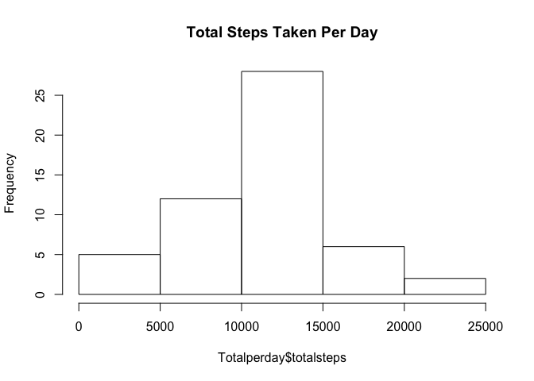
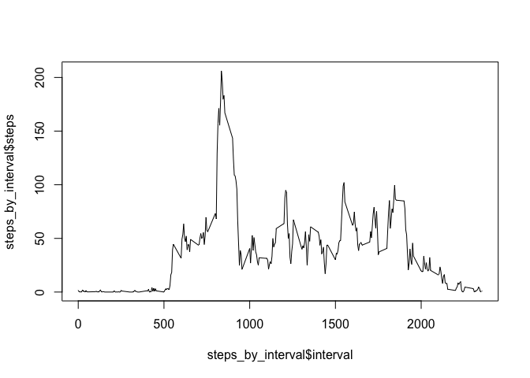
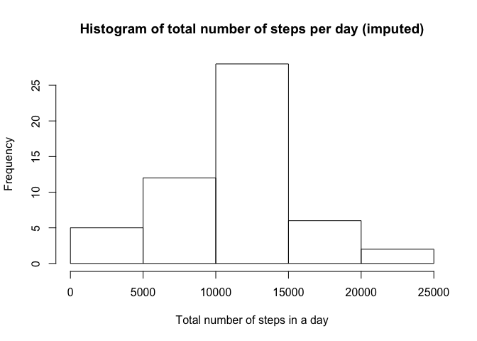
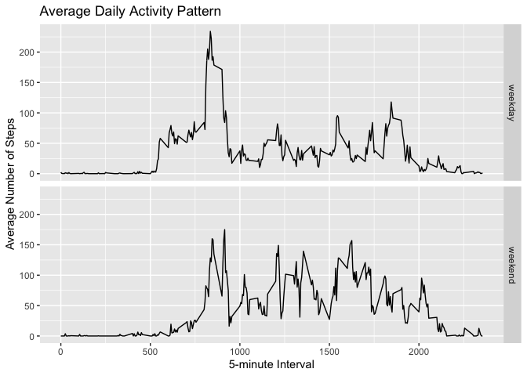

## Loading and preprocessing the data

```r
library(dplyr)
```

```
## 
## Attaching package: 'dplyr'
```

```
## The following objects are masked from 'package:stats':
## 
##     filter, lag
```

```
## The following objects are masked from 'package:base':
## 
##     intersect, setdiff, setequal, union
```

```r
activity <- read.csv("activity.csv", header = TRUE)
activity <- activity[ with (activity, { !(is.na(steps)) } ), ]
```

## What is mean total number of steps taken per day?


```r
Totalperday <- aggregate(activity$steps, list(activity$date), FUN = sum)
Totalperday <- Totalperday %>% rename( date = Group.1, totalsteps = x)
```
Have a look at the first few rows of the data

```r
head(Totalperday, 5)
```

```
##         date totalsteps
## 1 2012-10-02        126
## 2 2012-10-03      11352
## 3 2012-10-04      12116
## 4 2012-10-05      13294
## 5 2012-10-06      15420
```

Now to plot the total number of steps taken per day 

```r
hist(Totalperday$totalsteps, main = "Total Steps Taken Per Day")
```

<!-- -->
Here is our plot.

To calculate the mean and median of total number of steps per day

```r
mean_steps <- mean(Totalperday$totalsteps, na.rm = TRUE)
median_steps <- median(Totalperday$totalsteps, na.rm = TRUE)
```
The mean and median number of steps per day is 10766 and 10765, respectively.

A quick summary of the activity data

```r
summary(Totalperday)
```

```
##          date      totalsteps   
##  2012-10-02: 1   Min.   :   41  
##  2012-10-03: 1   1st Qu.: 8841  
##  2012-10-04: 1   Median :10765  
##  2012-10-05: 1   Mean   :10766  
##  2012-10-06: 1   3rd Qu.:13294  
##  2012-10-07: 1   Max.   :21194  
##  (Other)   :47
```


## What is the average daily activity pattern?
To make a time series plot of the 5-minute interval (x-axis) and the average number of steps taken, averaged across all days (y-axis)

```r
steps_by_interval <- aggregate(activity$steps, list(activity$interval),  mean)
steps_by_interval <- rename(steps_by_interval, "interval" = "Group.1", "steps" = "x")

plot(steps_by_interval$interval, steps_by_interval$steps, type = "l")
```

<!-- -->


To find the 5-minute interval, on average across all the days in the dataset, which contains the maximum number of steps


```r
max_steps <- which.max(steps_by_interval$steps)
steps_by_interval[max_steps, ]
```

```
##     interval    steps
## 104      835 206.1698
```
The interval with the maximum number of steps is row 104, corresponding to interval 835 and 179.1311 steps. 


## Imputing missing values
Note that there are a number of days/intervals where there are missing values (coded as NA). The presence of missing days may introduce bias into some calculations or summaries of the data.

To find number of rows with NAs

```r
sum(is.na(activity))
```

```
## [1] 0
```
A total of 2304 rows have NA values.

I choose to use the mean for that 5-min interval to fill in missing values.

```r
imputed_activity <- activity
for (i in 1:nrow(imputed_activity)) {
  if (is.na(imputed_activity$steps[i])) {
    interval_value <- imputed_activity$interval[i]
    steps_value <- steps_by_interval[
      steps_by_interval$interval == interval_value,]
    imputed_activity$steps[i] <- steps_value$steps
  }
}
```

Create a new dataset that is equal to the original dataset but with the missing data filled in.

```r
newactivity <- aggregate(steps ~ date, imputed_activity, sum)
head(newactivity)
```

```
##         date steps
## 1 2012-10-02   126
## 2 2012-10-03 11352
## 3 2012-10-04 12116
## 4 2012-10-05 13294
## 5 2012-10-06 15420
## 6 2012-10-07 11015
```

Make a histogram of the total number of steps taken each day and Calculate and report the mean and median total number of steps taken per day. Do these values differ from the estimates from the first part of the assignment? What is the impact of imputing missing data on the estimates of the total daily number of steps?

```r
hist(newactivity$steps, main="Histogram of total number of steps per day (imputed)", 
     xlab="Total number of steps in a day")
```

<!-- -->

```r
summary(newactivity)
```

```
##          date        steps      
##  2012-10-02: 1   Min.   :   41  
##  2012-10-03: 1   1st Qu.: 8841  
##  2012-10-04: 1   Median :10765  
##  2012-10-05: 1   Mean   :10766  
##  2012-10-06: 1   3rd Qu.:13294  
##  2012-10-07: 1   Max.   :21194  
##  (Other)   :47
```
The mean and median total number of steps per day is 10766 and 10765, respectively. The values are the same as the previously calculated.

There is no significant impact on outcome after imputing the missing values from the initial data.


## Are there differences in activity patterns between weekdays and weekends?
First, to assign whether each day in the dataset is a "weekday" or "weekend"

```r
imputed_activity['whichday'] <- weekdays(as.Date(imputed_activity$date))
imputed_activity$whichday[imputed_activity$whichday  %in% c('Saturday','Sunday') ] <- "weekend"
imputed_activity$whichday[imputed_activity$whichday != "weekend"] <- "weekday"
imputed_activity$whichday <- as.factor(imputed_activity$whichday)

newactivity <- aggregate(steps ~ interval + whichday, imputed_activity, mean)
```
To make a plot with two panels to show the 5-minute interval (x-axis) and the average number of steps taken, averaged across all weekday days or weekend days (y-axis).

```r
library(ggplot2)
ggplot(data = newactivity, aes(interval, steps), type = 'l') + geom_line() +facet_grid(whichday ~.) + ggtitle("Average Daily Activity Pattern") + xlab("5-minute Interval") + ylab("Average Number of Steps")
```

<!-- -->

